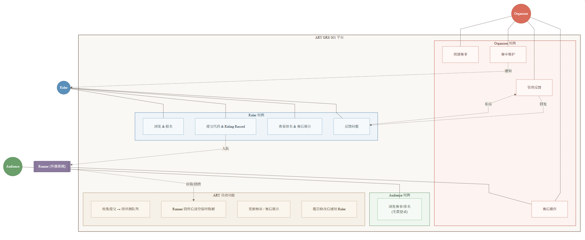
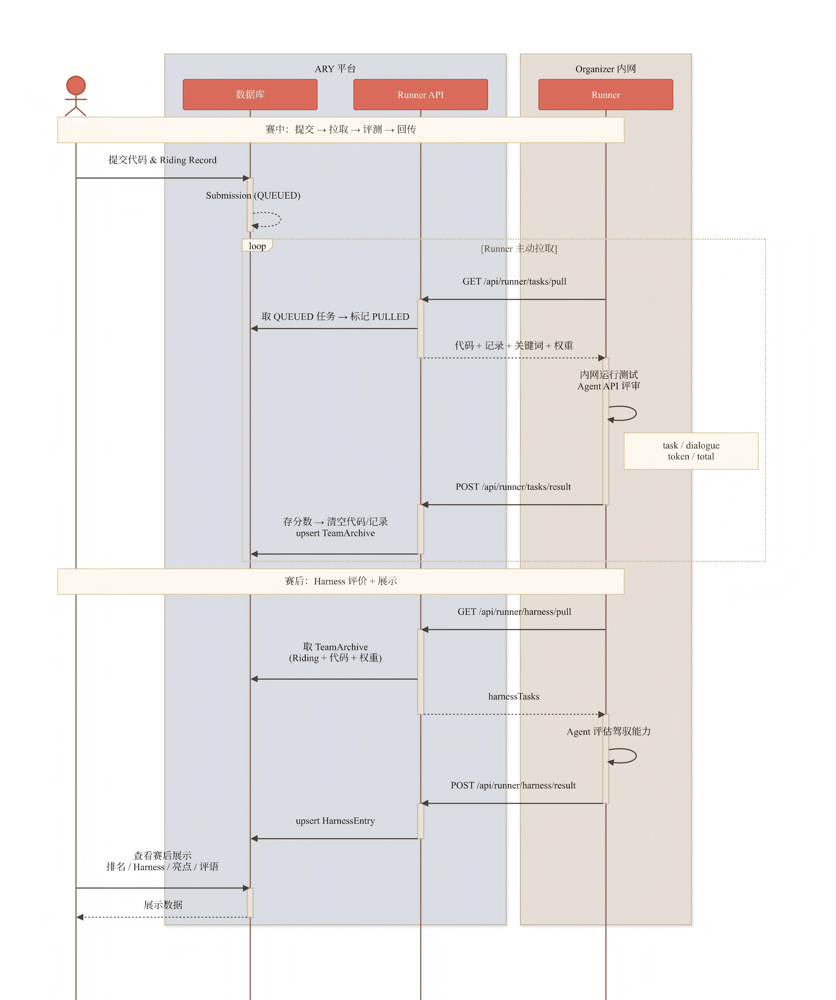
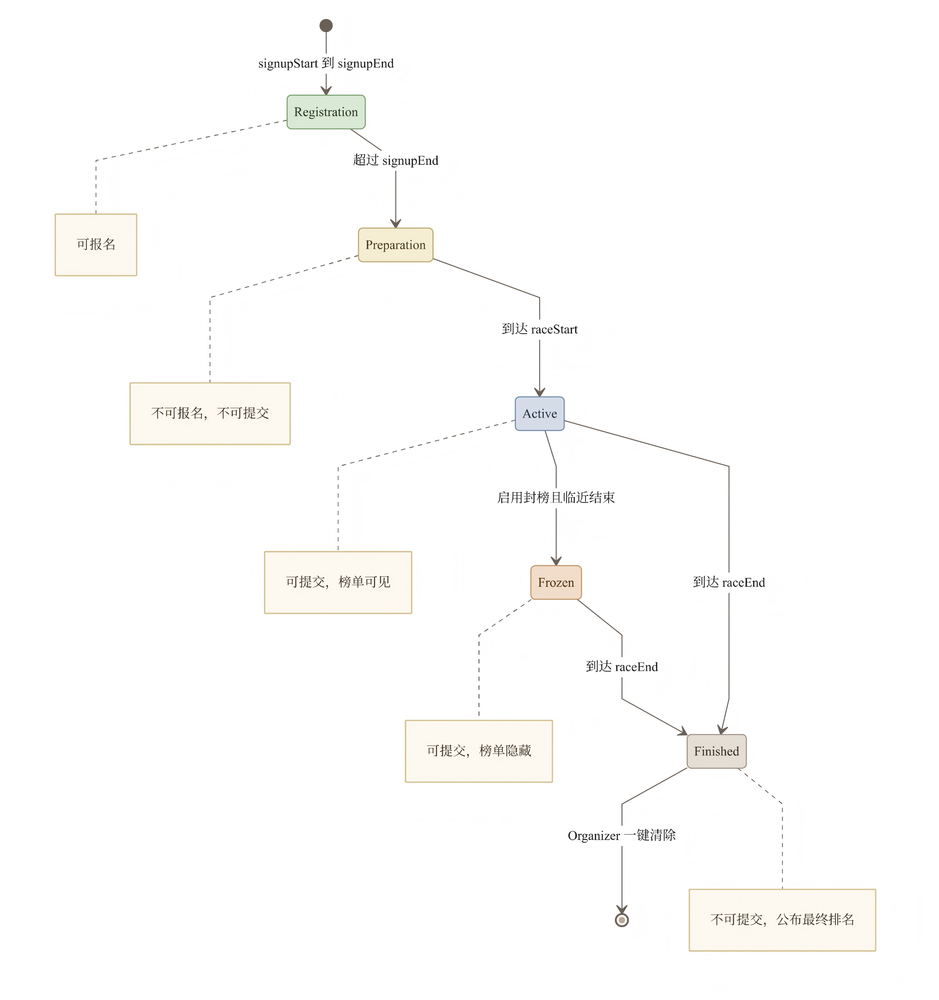

# 产品需求文档 7.0 版（GRS 001 + GRS 002）

## 1. 引言

### 1.1 编写目标

本文档旨在定义 Agent Racing Yard Genesis Race Series（简称 ARY GRS）的产品需求。

**GRS 001 核心命题（第 1–9 章）：** 在 Race 数据存留于 Organizer 侧、ARY 不持久化 Race 数据的前提下，ARY 如何完成赛事的创建、披露、组织与展示。

**GRS 002 扩展命题（第 10 章）：** 在 GRS 001 全栈 PoC 基础上，新增 Jumbotron 赛马大屏可视化子系统与 Calibrator 赛道校准编辑器，实现基于进度数据的实时赛马轨迹展示，并支持 Organizer 在创建赛事时自定义赛道参数。

### 1.2 读者对象

本文档的读者包括：

- 开发团队：理解产品需求，指导系统设计与实现
- 评审团队：评估产品定义
- 赛事主办方（Organizer）：了解平台能力与使用方式

### 1.3 文档概述

本文档分为以下部分：

- 第2章：软件系统概述，说明 ARY 的定位与 GRS 001 要解决的问题
- 第3章：数据结构设计，定义系统核心数据模型与枚举
- 第4章：功能性需求描述，定义角色、功能模块与业务流程
- 第5章：非功能性需求，定义安全、性能等要求
- 第6章：界面需求，定义页面与交互要求
- 第7章：接口定义，定义 Runner 接口
- 第8章：验收标准
- 第9章：GRS 001 下一步计划，记录当前版本的已知限制与改进方向
- 第10章：描述GRS 002 的Jumbotron 赛马大屏子系统

### 1.4 术语定义

| 术语          | 说明                                                  |
| ------------- | ----------------------------------------------------- |
| ARY           | Agent Racing Yard，智能体时代的软件开发训练场、竞技场 |
| GRS           | Genesis Race Series，ARY 的系列赛事                   |
| Organizer     | 赛事主办方，创建赛事、提供题目、进行评测              |
| Rider         | Rider，报名参加比赛、提交代码、查看排名               |
| Audience      | 观众，浏览比赛信息、查看排名                          |
| Runner        | Organizer私有评测程序，主动拉取任务并回传结果         |
| Riding Record | Rider与 Agent 的对话记录                              |

## 2. 软件系统概述

### 2.1 产品概述

ARY 是一个**去中心化的智能体赛事平台**。它的核心理念是：**Public Yard, Private Race Source**。

- 赛事数据主权属于 Organizer
- ARY 不持久化存储完整的 Race 数据
- ARY 只消费 Organizer 主动披露的数据
- ARY 负责赛事的创建、披露、组织与展示

**ARY 的核心能力：**

- 展示Organizer发布的竞赛题目
- 收集Rider的代码和 Riding 记录（赛后评估能力时再收集riding记录）
- 临时中转Rider提交到待评测队列
- Organizer 私有 Runner 主动拉取评测
- 接收评测结果并展示
- 展示榜单（按Organizer颗粒度实时更新）
- Rider向Organizer反馈问题
- Organizer修改题目/训练数据
- Organizer赛后评论
- **[GRS 002]** Jumbotron 赛马大屏：基于进度数据驱动的赛道可视化，实时展示马匹位置、排名变化、风险状态
- **[GRS 002]** Calibrator 赛道校准工具：可视化绘制赛道控制点，配置车道参数，导出 TrackProfile JSON

### 2.2 GRS 001 要解决的核心问题

**GRS 001 要解决的核心问题是：**

> 在 Race 数据存留于 Organizer 侧、ARY 不持久化 Race 数据的前提下，ARY 如何完成赛事的创建、披露、组织与展示？

**通过 GRS 001 必须证明的四个能力：**

1. Organizer可以创建赛事，数据保留在Organizer侧
2. ARY 不需要持久化完整 Race 数据
3. ARY 仍然可以创建、披露、组织、展示赛事
4. ARY 展示的内容来自 Organizer 主动披露的公开数据

### 2.3 用户特征

| 角色      | 说明                                     | 是否需要账号     |
| --------- | ---------------------------------------- | ---------------- |
| Organizer | 赛事主办方，创建赛事、提供题目、进行评测 | 是               |
| Rider     | 报名参加比赛、提交代码、查看排名         | 是               |
| Audience  | 观众，浏览比赛信息、查看排名、观看亮点   | 否（浏览不需要） |
| ARY       | 平台本身，负责创建、披露、组织、展示     | -                |

**说明**：

- 浏览比赛不需要登录
- 参加比赛/发布比赛需要登录

### 2.4 设计与实现约束

- 数据存储使用浏览器 localStorage
- 评测由Organizer私有 Runner 完成，ARY 不参与评分
- Organizer测试代码不离开Organizer内网

## 3. 数据结构设计

### 3.1 枚举类型

| 枚举 | 可选值 | 说明 |
| ---- | ------ | ---- |
| `UserRole` | `ORGANIZER` / `RIDER` | 用户角色 |
| `SubmissionStatus` | `QUEUED` → `PULLED` → `SCORED` / `FAILED` | 提交状态流转 |
| `RunnerTaskType` | `SUBMISSION_TEST` / `PROGRESS_EVAL` / `HARNESS_EVAL` | Runner 任务类型 |
| `RunnerTaskStatus` | `QUEUED` → `CLAIMED` → `SUCCEEDED` / `FAILED` / `STALE` | Runner 任务状态 |
| `FeedbackStatus` | `PENDING` / `RESOLVED` | 反馈线程状态 |
| `NotificationTarget` | `ALL` / `TEAM` | 通知接收范围 |
| `AgentType` | `CLAUDE` / `COPILOT` / `DEEPSEEK` / `ZHIPU` / `OPENAI` / `CUSTOM` | Rider 使用的 AI Agent 类型 |

### 3.2 核心模型概览

**用户**：`User` — id · username · passwordHash · role

**赛事**：`Race` — 题目包标识与描述、报名/比赛时间窗口、封榜配置、评分权重（含 Harness 子分权重 `harnessWeightReasoning`/`harnessWeightKeyword`）、赛后展示开关、Token 限制、提交冷却、Cloud Studio 链接；**[GRS 002]** 赛道参数：`trackId`（预设赛道 ID）、`trackCenterlineJson`（自定义控制点 JSON）、`trackDirection`（顺时针/逆时针）、`trackStartFinishS`（起/终点弧长比例 0–1）、`checkpointCount`（检查点数，等于赛事阶段数）

**参赛**
- `Team` / `TeamMember`：队伍关联赛事与队长；成员仅需 displayName（userId 可选）
- `Submission`：状态 `QUEUED → PULLED → SCORED/FAILED`；`codeContent` / `ridingRecord` 在 SCORED 后清空
- `SubmissionArtifact`：提交内容的不可变快照，供后续多轮 Runner 任务（PROGRESS_EVAL、HARNESS_EVAL）重复使用

**Runner 任务**：`RunnerTask` — taskType · status · score · reasoningScore · keywordScore · runnerComment · resultHash；新提交入队时同队伍同类型活跃任务自动置为 `STALE`

**结果与榜单**
- `TeamArchive`：PROGRESS_EVAL 成功后 upsert，保存代码快照与总分，供赛后 HARNESS_EVAL 使用
- `LeaderboardEntry`：比赛中进度排名，每队一条，PROGRESS_EVAL 后更新
- `HarnessEntry`：赛后驾驭能力分，HARNESS_EVAL 后更新；`harnessScore` 由 Runner 返回的 `reasoningScore`/`keywordScore` 加权计算
- `RidingHighlight`：前 N 名 Riding 亮点，每次 HARNESS_EVAL 完成后整体重建

**交互与通知**
- `FeedbackThread` / `FeedbackMessage`：每队一条线程，仅 Organizer 和对应队伍可见
- `Notification`：全体或指定队伍广播，Organizer 修改题目时自动创建
- `TeamComment`：Organizer 对每支队伍的赛后单独评论

## 4. 功能性需求描述

### 4.1 功能模块

#### 4.1.1 Organizer 端

- 注册/登录
- 创建赛事（基础信息、时间设置、评价标准、赛后展示选项、其他设置）
- 查看实时榜单
- 查看Rider反馈（可回复、标记状态）
- 比赛期间修改题目/训练数据（修改后通知所有Rider）
- 赛后评论（可对所有队伍评论）
- 一键清除比赛

#### 4.1.2 Rider 端

- 注册/登录
- 浏览赛事列表（按状态分类）
- 报名参赛（填写组员信息，不超过人数上限）
- 组内协作（可通过 DC）
- 提交代码和 Riding 记录（受提交频率限制）
- 查看实时进度排名
- 向 Organizer 反馈问题
- 接收 Organizer 题目修改通知

#### 4.1.3 Audience 端

- 浏览赛事（无需登录）
- 查看公开排名
- 查看赛后展示内容



> Runner 是 Organizer 部署的外部评测程序，通过 API 与 ARY 交互，不作为人类 Actor。ARY 自动功能（收集提交、清空临时数据、更新榜单、发送通知）由系统事件驱动执行。

### 4.2 核心业务流程

#### 4.2.1 Race 创建流程

Organizer 登录后填写：

**基础信息：**

- 赛事名称、简介
- 题目压缩包（含任务描述，可含训练数据）
- 是否有训练数据（勾选后 ARY 不处理）

**时间设置：**

- 报名开始时间、报名结束时间
- 比赛开始时间、比赛结束时间

**时间线说明：**

- 报名开始时间 ≤ 报名结束时间 ≤ 比赛开始时间 ≤ 比赛结束时间

**评价标准：**

- Organizer自定义，由Organizer自己的 Runner 进行评分
- ARY 只接收Organizer Runner 回传的最终分数

**赛后展示选项：**

- Organizer提供的题目
- 训练数据
- Organizer评论
- 展示前N名 Riding 亮点（默认3）
- Rider代码

**其他设置：**

- 每组人数上限（默认5人）
- 提交频率限制（默认24小时一次）
- 一键清除比赛

#### 4.2.2 Rider请求测试流程

1. Rider点击测试
2. 发送代码给 ARY
3. ARY 记录Rider信息
4. ARY 把代码发给 Organizer 的 Runner
5. Organizer 在自己环境进行评测
6. Organizer 返回结果给 ARY
7. ARY 返回结果给Rider

#### 4.2.3 ARY规定颗粒度时间自动读取进度流程

1. ARY 每隔固定颗粒度给 Organizer 发送读取进度请求
2. Organizer收到请求后，读取一次 Runner 拉取的 Rider 的代码，并计算进度
3. Organizer返回进度结果给ARY
4. ARY在榜单中更新，展示进度

#### 4.2.4 赛后评价Rider驾驭能力流程

1. ARY在比赛结束后，自动读取Rider的Riding记录和代码
2. ARY记录Rider信息
3. ARY发送Riding记录和代码给Organizer
4. Organizer根据记录和代码进行Harness能力评价
5. Organizer返回评价结果给ARY
6. ARY在Harness能力榜单中更新并展示

**图 2：核心业务时序图**



> **数据边界**：Submission 中代码/记录在 Runner 回传后立即清空；TeamArchive 保留每队最高分提交的完整副本供赛后使用；HarnessEntry 存储 Organizer 回传的驾驭能力评价结果。ARY 不持有 Organizer 私有评测代码与 Runner 实现。

#### 4.2.5 比赛状态转换

**图 3：Race 赛事状态机**



> **状态与代码映射**：报名中 = `registration` · 报名结束 = `preparation` · 比赛中 = `active` · 封榜中 = `frozen` · 比赛结束 = `finished`。封榜（Frozen）为可选阶段，由 Organizer 创建赛事时设置 `enableFreeze` 及封榜提前量 `freezeMinutesBeforeEnd` 控制。

| 状态     | 条件                                  | Rider可操作              |
| -------- | ------------------------------------- | ------------------------ |
| 报名中   | 当前时间在报名开始~报名结束之间       | 可报名                   |
| 报名结束 | 当前时间在报名结束~比赛开始之间       | 不可报名，等待开始       |
| 比赛中   | 当前时间在比赛开始~比赛结束之间       | 已报名的可提交           |
| 封榜中   | 启用封榜，距比赛结束 ≤ freezeMinutes | 已报名的可提交，榜单隐藏 |
| 比赛结束 | 当前时间晚于比赛结束                  | 不可提交，查看最终排名   |

### 4.3 数据定义

#### 4.3.1 Organizer 侧数据（不存储在 ARY）

- Runner环境
- 测试代码
- 由Runner拉取的各个Rider的代码和Riding记录
- 进度评价程序
- Harness能力评价程序

#### 4.3.2 ARY 侧存储数据

- Race题目和可能有的训练数据
- 进度榜单
- 赛后的Harness能力榜单
- 反馈记录
- 通知记录

#### 4.3.3 Rider临时数据

- 提交的代码（评测完成后从队列中删除）
- Riding 记录（赛后评价完Harness能力后删除）

### 4.4 赛后展示逻辑

**直接公开（无需勾选）：**

- 完整排名
- Organizer提供的题目

**Organizer可勾选：**

- 训练数据
- Organizer评论
- 前N名 Riding 亮点（Organizer设置 N 值，默认3）
- Rider代码

### 4.5 Rider反馈功能

Rider在比赛期间可通过 ARY 向Organizer发送私信，反馈以下问题：

- 题目描述不清或存在歧义
- 训练数据问题
- 其他与竞赛相关的问题

**反馈可见性**：

- Organizer：可见所有队伍的反馈
- Rider：仅可见自己队伍的反馈及Organizer回复
- 其他队伍：不可见

**反馈状态**：

- pending：待处理
- resolved：已处理

### 4.6 Organizer修改题目/训练数据

Organizer收到Rider反馈后，可在比赛期间修改：

- 题目描述
- 训练数据

**注**：Organizer测试代码和关键词配置不可修改（防止影响评分公平性）

**通知机制**：Organizer修改后，ARY 自动向所有Rider发送通知。

## 5. 非功能性需求

### 5.1 安全性

| ID   | 约束                                   | 实现方式                                |
| ---- | -------------------------------------- | --------------------------------------- |
| S-01 | Organizer测试代码不暴露给Rider         | 存储在Organizer自己数据库中，不传给 ARY |
| S-02 | Organizer未勾选的展示选项赛后自动清除  | ARY 根据勾选决定展示内容                |
| S-03 | Organizer可一键清除比赛                | 提供"清除比赛"按钮                    |
| S-04 | Organizer可通过ARY拉取Rider数据        | Organizer通过Runner固定颗粒度自动拉取   |
| S-05 | Rider反馈内容仅Organizer和对应队伍可见 | 反馈消息不公开                          |
| S-06 | Organizer测试代码不离开Organizer内网   | Runner在Organizer内运行                 |

### 5.2 去中心化与去持久化

- Race 数据主权属于 Organizer
- ARY 不持久化完整 Race 数据
- Rider代码临时存储，被Organizer存储完成后删除
- Organizer可一键清除比赛所有数据

## 6. 界面需求

### 6.1 赛事列表页

- 按状态分类展示（报名中、报名结束、比赛中、比赛结束）
- 观众无需登录即可浏览

### 6.2 赛事详情页

- 展示比赛名称、时间、规则、公开描述
- 进度排名榜单
- 报名按钮（登录后可见）
- 提交入口（报名成功且比赛中可见）

### 6.3 赛后展示页

- 完整排名
- 前 N 名 Riding 亮点（按Organizer设置）
- Organizer评论
- Organizer公开的题目和训练数据

## 7. 接口定义

### 7.1 认证

所有 Runner API 均通过 HTTP Header 进行 Bearer Token 认证：

```
Authorization: Bearer {RUNNER_TOKEN}
```

Token 通过服务端环境变量 `RUNNER_TOKEN` 配置，默认值为 `ary-runner-dev-secret`（仅供本地开发，生产环境必须替换）。认证失败返回 `401 Unauthorized`。

### 7.2 Runner 拉取任务

**请求：**

```
GET /api/runner/tasks/pull?raceId={raceId}
Authorization: Bearer {runner_token}
```

**响应（有任务时）：**

```json
{
  "task": {
    "taskId": "clxxxxxxxxxxxxxx",
    "taskType": "submission_test",
    "raceId": "clxxxxxxxxxxxxxx",
    "teamId": "clxxxxxxxxxxxxxx",
    "teamName": "排序小分队",
    "submissionId": "clxxxxxxxxxxxxxx",
    "createdAt": "2026-01-01T00:00:00.000Z",
    "metadata": {
      "attemptNo": 1,
      "fileName": "solution.ts",
      "fileSize": 1024,
      "status": "queued",
      "uploadedAt": "2026-01-01T00:00:00.000Z"
    },
    "taskPackageLabel": "sort-task-v1",
    "taskDescription": "实现快速排序算法...",
    "keywords": ["需求分析", "时间复杂度"],
    "codeLabel": "solution.ts",
    "codeContent": "// Rider 提交的代码内容",
    "recordLabel": null,
    "ridingRecord": null,
    "tokenUsed": 5000,
    "agentType": "CLAUDE"
  }
}
```

**响应（无任务时）：**

```json
{ "task": null }
```

**字段说明：**

| 字段 | 类型 | 说明 |
| ---- | ---- | ---- |
| `taskId` | String | 任务唯一标识，回传结果时使用 |
| `taskType` | String | `submission_test` / `progress_eval` / `harness_eval` |
| `raceId` / `teamId` / `submissionId` | String | 关联标识 |
| `teamName` | String | 队伍名称 |
| `createdAt` | ISO 8601 | 任务入队时间 |
| `metadata.attemptNo` | Int | 固定为 1（当前版本） |
| `metadata.fileName` | String | 代码文件名 |
| `metadata.fileSize` | Int | 代码字节数 |
| `taskPackageLabel` | String | 题目包标识 |
| `taskDescription` | String | 题目描述 |
| `keywords` | String[] | 评分关键词列表 |
| `codeLabel` | String | 代码文件名 |
| `codeContent` | String | 代码内容（明文字符串） |
| `recordLabel` | String \| null | Riding Record 文件名，仅 `harness_eval` 任务非 null |
| `ridingRecord` | String \| null | Riding Record 内容，仅 `harness_eval` 任务非 null |
| `tokenUsed` | Int | Rider 使用的 Token 数量 |
| `agentType` | String | Rider 使用的 AI Agent 类型 |

> 拉取成功后，ARY 将该任务状态置为 `CLAIMED`；对于 `submission_test` 任务，关联 Submission 状态同步置为 `PULLED`。

### 7.3 Runner 回传结果

**请求：**

```
POST /api/runner/tasks/result
Authorization: Bearer {runner_token}
Content-Type: application/json
```

**请求体：**

```json
{
  "taskId": "clxxxxxxxxxxxxxx",
  "submissionId": "clxxxxxxxxxxxxxx",
  "status": "succeeded",
  "score": 88.6,
  "runnerComment": "8/8 test cases passed.",
  "resultHash": "sha256:abc123...",
  "finishedAt": "2026-01-01T00:10:00.000Z"
}
```

**字段说明：**

| 字段 | 是否必填 | 说明 |
| ---- | -------- | ---- |
| `taskId` | 必填 | 拉取任务时获得的任务 ID |
| `submissionId` | 必填 | 拉取任务时获得的提交 ID |
| `status` | 必填 | `"succeeded"` 或 `"failed"` |
| `score` | 必填 | 评测分数（Float，建议范围 0–100） |
| `runnerComment` | 可选 | Runner 给出的评语或错误信息 |
| `resultHash` | 可选 | 评测结果哈希，供防作弊校验使用 |
| `finishedAt` | 可选 | 评测完成时间（ISO 8601），缺省时由 ARY 记录接收时间 |

**响应（成功）：**

```json
{ "ok": true }
```

### 7.4 数据生命周期

Runner 回传结果后，ARY 按任务类型执行以下数据操作：

| 任务类型 | 成功时 ARY 执行的操作 |
| -------- | --------------------- |
| `submission_test` | Submission 的 `codeContent` / `ridingRecord` 清空（设为 null）；`totalScore` 写入；状态置为 `SCORED` |
| `progress_eval` | upsert `TeamArchive`（存档代码快照和分数）；upsert `LeaderboardEntry`（更新榜单分数） |
| `harness_eval` | upsert `HarnessEntry`（Harness 分数）；重建 `RidingHighlight`（前 N 名驾驭亮点） |

> `SubmissionArtifact` 是代码和 Riding Record 的不可变快照，在 `submission_test` 成功后依然保留，供后续 `progress_eval` / `harness_eval` 使用，不会被清空。

## 8. 验收标准

### 8.1 核心功能验收

- [ ] Race 公开数据可以留在 ARY 侧
- [ ] ARY 不需要持久化保存私密 Race 数据
- [ ] ARY 仍然可以创建、披露、组织、展示赛事
- [ ] 赛中 ARY 可以展示进度榜单
- [ ] 赛后展示内容来自 Organizer 主动披露的公开数据

### 8.2 功能验收

- [ ] Organizer 可创建赛事（含基础信息、时间设置、评价标准、赛后展示选项、其他设置）
- [ ] 时间设置包含报名开始/结束时间和比赛开始/结束时间
- [ ] 每组人数上限默认为5人
- [ ] Rider可浏览赛事列表并按状态分类
- [ ] Rider可在报名时间内报名
- [ ] Rider可在比赛时间内提交代码
- [ ] 提交频率限制生效
- [ ] 榜单按颗粒度更新
- [ ] Rider可向 Organizer 反馈问题
- [ ] Organizer 可查看反馈并回复
- [ ] Organizer 可修改题目/训练数据并通知Rider
- [ ] 赛后完整排名直接公开
- [ ] Organizer 可设置展示前N名 Riding 亮点
- [ ] Organizer 可对所有队伍赛后评论
- [ ] 赛后根据Organizer勾选展示内容
- [ ] Organizer 可通过runner拉取Rider的代码和 Riding 记录
- [ ] Organizer 可一键清除比赛
- [ ] Audience 可浏览公开信息（无需登录）

### 8.3 安全验收

- [ ] Organizer测试代码不暴露给Rider和ARY
- [ ] Organizer测试代码不离开Organizer内网
- [ ] Organizer未勾选的展示选项赛后自动清除
- [ ] Organizer可一键清除比赛
- [ ] Rider反馈内容仅Organizer和对应队伍可见
- [ ] Rider提交代码和记录在 Runner 回传结果后自动删除

## 9. 下一步计划

### 9.1 当前方案的限制

本版本（GRS 001）聚焦于验证核心命题：**在数据主权归 Organizer 的前提下，ARY 能否完成赛事的创建、披露、组织与展示**。以下功能在本版本中暂未实现或仅初步涉及：

| 功能                       | 当前状态                   | 限制说明                                             |
| -------------------------- | -------------------------- | ---------------------------------------------------- |
| 组队功能（小组管理）       | 初步实现报名时填写组员信息 | 缺乏完整的组队流程（创建队伍、邀请成员、队长权限等） |
| Reviewer/Contributor 角色  | 未实现                     | 缺乏代码审核流程和角色权限区分                       |
| Agent 给出参赛队伍建议     | 未实现                     | 赛后评价依赖人工，未接入 Agent 自动分析              |
| 比赛期间更正题目后排名处理 | 未实现                     | 更正后是否清空排名、是否加时等规则未定义             |
| 异常状态下的 UI 反馈       | 未实现                     | Runner 超时、评测失败、网络中断等异常发生后，Rider 侧缺乏清晰的错误状态展示与重试引导 |
| 题目上传方式               | 仅命名无实际上传           | 创建赛事时题目包仅填写文件名字符串，无实际文件上传按钮；Rider 无法从 ARY 下载题目文件 |

### 9.2 组队功能的改进方向

当前版本在报名阶段预留了组队接口（填写组员信息，不超过人数上限），但完整的组队功能尚未实现。下一版本的重点改进方向：

1. **队伍创建与管理**：Rider 可创建队伍、设置队伍名称、邀请其他 Rider 加入
2. **队长权限**：队长可审批加入申请、解散队伍、移交队长权限
3. **队伍可见性**：支持公开队伍（可被搜索）和私有队伍（仅邀请链接）
4. **队伍规模限制**：Organizer 创建赛事时可设置队伍人数上限（当前已支持）
5. **队伍成员管理**：成员可主动退出、队长可移除成员

### 9.3 Reviewer/Contributor 角色的改进方向

1. **角色定义**：小组内设置 Reviewer（审核者）和 Contributor（贡献者）角色
2. **提交审核流程**：Contributor 提交代码后需经 Reviewer 审核通过才计入成绩
3. **权限区分**：Reviewer 有审核权限，Contributor 仅有提交权限

---

## 10. GRS 002 扩展：Jumbotron 可视化子系统

> 本章定义 GRS 002 新增的 Jumbotron 赛马大屏与 Calibrator 赛道编辑器的产品需求。第 1–9 章的所有内容在 GRS 002 中继续有效。

### 10.1 背景与目标

GRS 001 已验证核心命题（数据边界 + Runner 协议 + 全栈 PoC）。GRS 002 在此基础上新增赛场可视化层：将 Runner 回传的进度数据实时映射为赛道上的马匹位置，提供对评审和观众友好的可视化展示，同时提供 Calibrator 工具让 Organizer 可自定义赛道轮廓。

### 10.2 核心概念

#### 10.2.1 三维数据模型

Jumbotron 大屏的所有视觉元素由三条独立数据流驱动，互不混淆：

| 维度 | 触发方 | Runner 任务类型 | 存储位置 | 在大屏上的映射 |
|------|--------|-----------------|----------|----------------|
| **进度**（Progress） | ARY 调度 → Runner 自动 | `PROGRESS_EVAL` | `LeaderboardEntry.totalScore` | 马匹位置（弧长比例 s） |
| **质量**（Quality） | Rider 主动提交 | `SUBMISSION_TEST` | `Submission.totalScore`（最新 SCORED） | 辅助参考，不驱动位置 |
| **风险/违规**（Risk） | ARY 推导 | — | `antiCheatPenalty > 0` | 虚线彩圈光环、红色违规徽章 |

> **关键约束**：马匹位置仅由进度分（`PROGRESS_EVAL`）决定。主动提交（`SUBMISSION_TEST`）的质量分不影响马匹位置。两者来源绝对不可混淆。

#### 10.2.2 赛道系统（TrackProfile）

赛道由一组 1920×1080 坐标系内的二维控制点定义，通过 Catmull-Rom 样条插值生成平滑闭合曲线。一个 `TrackProfile` 包含：

- `centerline.points`：控制点数组，至少 4 个
- `centerline.smoothing`：`"catmull-rom"`
- `laneHalfWidth`：赛道半宽（像素），决定车道宽度
- `lanes`：车道数组（`laneId`、offset 相对赛道中心的偏移量）
- `startFinish.s`：起/终点弧长比例（0–1）
- `direction`：`"clockwise"` 或 `"counterclockwise"`
- `viewBox`：坐标系宽高（1920×1080）

**内置预设：**

| trackId | 形状 | 控制点数 |
|---------|------|----------|
| `oval-standard` | 标准椭圆（默认） | 12 |
| `rect-standard` | 标准方形 | 12 |

#### 10.2.3 弧长参数化与马匹定位

`TrackRuntime` 引擎对曲线执行弧长参数化（arc-length parameterization），使 `sampleAt(s)` 以等速比例返回位置和方向：

- `s = LeaderboardEntry.totalScore / 100`（0%–100% 进度映射到 0.0–1.0 弧长）
- `sampleAt(s)` 返回 `{ pos, tangent, normal }`，其中 `normal` = 切线逆时针旋转 90°
- 车道偏移公式：`offset = -halfWidth + (2×halfWidth) / (N+1) × (laneIdx+1)`

#### 10.2.4 Calibrator（赛道校准工具）

Calibrator 是一个独立的可视化编辑器（`/jumbotron/calibrator`），与 Jumbotron 共用同一套 `TrackRuntime` 引擎。它的职责是让 Organizer 在创建赛事前可视化地设计赛道轮廓，并将结果导出为 `TrackProfile` JSON 或直接粘贴到创建比赛表单。

### 10.3 功能性需求

#### 10.3.1 Jumbotron 大屏（`/jumbotron?raceId=<id>`）

**必须展示：**

| 元素 | 数据来源 | 说明 |
|------|----------|------|
| 真实赛场底图 | 静态图片 `/jumbotron底图.jpg` | 作为背景，`preserveAspectRatio="xMidYMid slice"` 填充 |
| 土黄色赛道环 | TrackProfile + SVG mask | `#c4924a`，mask 绘制无裂缝 |
| 绿色内场 | 内圈 clipPath | `rgba(10,55,10,0.28)` 叠加 |
| 白色护栏 | 内外边界路径 | 双层（柔光 + 锐边），`rgba(255,255,255,0.95)` |
| 检查点 | `checkpointCount` 均分 | 琥珀 `#f59e0b` 虚线 + 端头圆柱 |
| 起/终点线 | `startFinishS` | 白色 + 黑色棋格叠加 |
| 马匹 | `LeaderboardEntry.totalScore` | 带队伍色彩的圆形标记 + 排名数字 |
| 排名变化 ↑↓ | `sessionStorage` 快照对比 | 绿色上升 / 红色下降 |
| 风险光环 | `antiCheatPenalty` + 分数差 | 橙=中风险，红=高风险 |
| 违规徽章 | `antiCheatPenalty > 0` | 红色 `!` 角标 |
| 气泡消息 | 里程碑 / 排名变化 | 25/50/75/100% 里程碑优先；4 秒淡出；最多 3 条 |
| 左侧面板 | 多数据源 | 活跃骑手 TOP3 + 赛道小地图 + KPI |
| 底部 ticker | 风险/违规队伍 | 滚动提示 |

**调试模式（`?debug=1`）：** 叠加中心线、车道边界、每匹马 s 值、碰撞框。

**刷新机制：** 每 30 秒执行 `router.refresh()` 拉取新服务端数据。

#### 10.3.2 Calibrator（`/jumbotron/calibrator`）

**必须支持的操作：**

| 操作 | 说明 |
|------|------|
| 添加控制点 | 单击 SVG 画布空白处 |
| 移动控制点 | 鼠标拖拽 |
| 删除控制点 | 双击控制点 |
| 加载预设 | 点击"预设：椭圆"/"预设：方形"，≥ 4 点立即渲染 |
| 实时预览 | ≥ 4 点自动渲染 Catmull-Rom 曲线、车道、检查点、起/终点 |
| 马匹预览 | Scrubber（0–1）查看任意 s 位置的马匹分布（验证 lane offset） |
| 配置车道 | 车道数 + laneHalfWidth |
| 设置方向 | 顺时针 / 逆时针 |
| 设置起/终点 | S 值（0.0–1.0）输入 |
| 上传底图 | PNG/JPG/WebP，透明度可调，无底图时默认显示赛场照片 |
| 显示控制点序号 | 开关切换 |
| 验证 | 检查点数（≥4）、弧长（> 0）、laneId 非空、车道数（≥1） |
| 下载 profile.json | 导出完整 TrackProfile JSON |
| 复制控制点 | 仅导出 `[[x,y],...]` 格式，粘贴到创建比赛表单 |
| 清空 | 清除所有控制点 |

**视觉要求（与 Jumbotron 保持一致）：**

- 赛场底图（无用户上传时默认 0.28 透明度）
- 土黄色 `#c4924a` 赛道面（SVG mask，无裂缝）
- 白色护栏（双层渲染）
- 琥珀 `#f59e0b` 检查点 + 圆柱端头
- 黑/白棋格起终线

#### 10.3.3 Organizer 创建比赛时的赛道参数

在创建比赛表单中新增以下字段：

| 字段 | 类型 | 默认值 | 说明 |
|------|------|--------|------|
| `trackId` | 下拉 | `oval-standard` | 选择预设赛道 |
| `trackDirection` | 下拉 | `counterclockwise` | 顺时针 / 逆时针 |
| `trackStartFinishS` | 数字输入 0–1 | `0.0` | 起/终点弧长比例 |
| `trackCenterlineJson` | 文本框 | 空 | 自定义控制点 JSON，覆盖 trackId |
| Calibrator 链接 | — | — | 引导 Organizer 用 Calibrator 生成控制点 |

### 10.4 技术规格

#### 10.4.1 共享引擎文件

```
Jumbotron/
  types.ts            — TrackProfile, RacingEntrySnapshot, HorsePose 等接口
  track-runtime.ts    — Catmull-Rom 样条 + 弧长参数化（sampleAt / getPathD）
  adapter.ts          — LeaderboardEntry + Submission + TeamArchive → RaceSnapshot
  tracks/
    track.profile.json   — 标准椭圆（12 控制点）
    rect.profile.json    — 标准方形（12 控制点）
```

#### 10.4.2 SVG 渲染技术

- **无裂缝赛道环**：使用 `<mask>`（外圈=白色，内圈=黑色）+ 单一 `<rect fill="#c4924a">`，避免两层 fill 的抗锯齿间隙
- **内场**：`<clipPath>` + `rgba(10,55,10,0.28)` 叠加 rect
- **唯一 ID**：使用 `useId()` 为每个 TrackSVG 实例生成唯一 mask/clipPath ID，避免多实例冲突
- **背景图**：`preserveAspectRatio="xMidYMid slice"` 填充 SVG 并裁剪两侧

#### 10.4.3 数据库迁移

| 迁移文件 | 新增列 |
|---------|--------|
| `20260610000000_jumbotron_track` | `Race.trackId`, `Race.checkpointCount` |
| `20260612000000_add_track_direction` | `Race.trackDirection`, `Race.trackStartFinishS` |

### 10.5 验收标准（GRS 002）

| # | 验收项 | 状态 |
|---|--------|------|
| V01 | Jumbotron 大屏可访问且正确渲染马匹位置 | ✅ |
| V02 | 马匹位置仅由 PROGRESS_EVAL 结果驱动，与 SUBMISSION_TEST 无关 | ✅ |
| V03 | ≥ 2 条预设赛道（椭圆 + 方形）可正常渲染 | ✅ |
| V04 | Calibrator 可添加/移动/删除控制点，实时预览赛道 | ✅ |
| V05 | Calibrator 控制点与 Jumbotron 使用相同预设数据 | ✅ |
| V06 | Calibrator 可导出 TrackProfile JSON | ✅ |
| V07 | Calibrator 与 Jumbotron 共用 TrackRuntime 引擎 | ✅ |
| V08 | Organizer 创建比赛时可配置 trackDirection / trackStartFinishS | ✅ |
| V09 | 自定义控制点 JSON 可从 Calibrator 粘贴到创建比赛表单并生效 | ✅ |
| V10 | 排名变化（↑↓）在 30 s 刷新后正确计算并展示 | ✅ |
| V11 | 风险光环和违规徽章按数据正确显示 | ✅ |
| V12 | 气泡消息在里程碑 / 排名变化时弹出，4 秒淡出 | ✅ |
| V13 | `?debug=1` 可激活调试叠加层 | ✅ |
| V14 | SVG 赛道环无裂缝（mask 方案） | ✅ |
| V15 | Calibrator 操作区字号 ≥ 13px，可读性满足要求 | ✅ |
