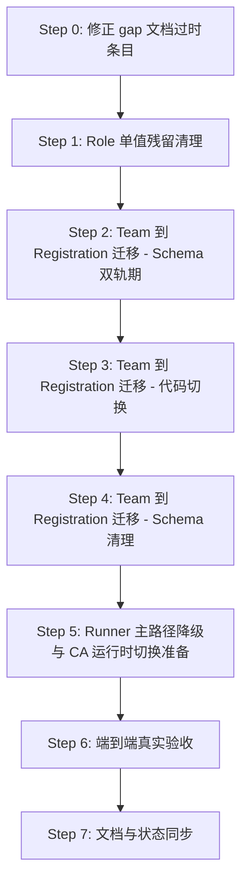

# GRS003 Gap 收口计划

版本：v1.0 | 日期：2026-06-19

## 当前认知修正

gap-analysis v1.1 有 3 条判断已过时，需要先修正才能排期：

| # | 原判断 | 实际现状 | 应改为 |
|---|--------|----------|--------|
| G1 | GitHub OAuth 完全未开始 ❌ | 主链路代码已具备：github-oauth.ts / callback route / loginWithGitHubAction / login page | 🔶 主链路已实现，缺真实验收与登录模型收口 |
| G2 | CA Push+Fetch 未实现 ❌ | 最小闭环已具备：handshake / signals / snapshot fetch API + connector demo | 🔶 最小闭环已具备，旧 runner 主路径尚未退场 |
| G3 | build 环境阻塞 ❌ | db:generate / typecheck / build 均已通过 | ✅ 已修复 |

## 迁移总览

本轮收口聚焦两条主线，按依赖关系排序：

---

## Step 0: 修正 gap 文档过时条目

- 更新 `docs/grs003/grs003-gap-analysis.md` 中 3 条过时判断
- 在更新记录中追加 v1.2 条目

---

## Step 1: Role 单值残留清理

### 当前状态

Prisma schema 里 `User` 同时有：
- `role UserRole @default(RIDER)` — 单值枚举
- `rolesJson String @default('[RIDER]')` — JSON 数组

代码里双轨并存：
- `auth.ts` session payload 同时写入 `role` 和 `roles`
- `users.ts` 同时写入 `role` 和 `rolesJson`
- `github-oauth.ts` 同时写入 `role` 和 `rolesJson`
- `getSessionUser()` / `loadDatabaseUser()` 从 `rolesJson` 恢复多角色后仍回填 `role`

### 迁移方案

1. 在所有读取 `user.role` 的地方改为 `getDefaultActiveRole(parseRolesJson(user.rolesJson))`
2. Session payload 保留 `roles` 数组，移除 `role` 单值（或仅作为 computed cache）
3. Prisma schema 移除 `User.role` 字段，只保留 `rolesJson`
4. 运行 `prisma migrate` / `db:generate`
5. 清理 `getDefaultActiveRole` 调用链：不再需要从 `role` fallback

### 影响文件

| 文件 | 改动类型 |
|------|----------|
| `prisma/schema.prisma` | 移除 `User.role` 字段 |
| `src/lib/auth.ts` | session 不再写 `role`；`getSessionUser` 不再读 `payload.role` |
| `src/lib/services/users.ts` | `createUser` / `updateUserRoles` 不再写 `role` |
| `src/lib/github-oauth.ts` | `createUserFromGitHubProfile` / `finishGitHubOAuth` 不再写 `role` |
| `src/lib/user-roles.ts` | 无变动（已纯函数） |
| 多处测试 | 调整 fixture 不再提供 `role` 单值 |

---

## Step 2-4: Team 到 Registration 深层迁移

这是最大结构债，需要分 3 个子阶段避免一次性断路。

### 影响面统计

Prisma schema 中引用 `teamId` 的模型共 **11 个**：

| 模型 | teamId 用途 | @@unique 约束 | 目标 registrationId 语义 |
|------|------------|---------------|--------------------------|
| Team | 自身 PK | `@@unique([raceId, captainId])` | 将被删除 |
| TeamMember | 组员 | 无 | 将被删除 |
| Submission | 提交容器 | 无 | 提交归属 Registration |
| SubmissionArtifact | 提交产物 | 无 | 归属 Registration |
| RunnerTask | 评测任务 | 索引 `[teamId, taskType, createdAt]` | 归属 Registration |
| TeamArchive | 赛后归档 | `@@unique([raceId, teamId])` | 归属 Registration |
| FeedbackThread | 反馈线程 | 无 | 归属 Registration |
| Notification | 通知目标 | `teamId?` 可选 | 归属 Registration |
| LeaderboardEntry | 榜单 | `@@unique([raceId, teamId])` | 归属 Registration |
| HarnessEntry | 评测分项 | `@@unique([raceId, teamId])` | 归属 Registration |
| RidingHighlight | 亮点 | 无 | 归属 Registration |
| TeamComment | 主办方评语 | `@@unique([raceId, teamId])` | 归属 Registration |

代码中引用 `teamId` 的服务/组件共 **15+** 个文件。

### Step 2: Schema 双轨期

目标：在所有 teamId 模型上**新增** `registrationId` 字段，但不删除 `teamId`，让两轨共存。

1. Prisma schema 变更：
   - `Submission` 新增 `registrationId String?` + FK
   - `SubmissionArtifact` 新增 `registrationId String?` + FK
   - `RunnerTask` 新增 `registrationId String?` + FK
   - `TeamArchive` 新增 `registrationId String?` + FK
   - `FeedbackThread` 新增 `registrationId String?` + FK
   - `LeaderboardEntry` 新增 `registrationId String?` + FK
   - `HarnessEntry` 新增 `registrationId String?` + FK
   - `RidingHighlight` 新增 `registrationId String?` + FK
   - `TeamComment` 新增 `registrationId String?` + FK
   - `Notification` 新增 `registrationId String?`
2. 写数据填充脚本：根据 `team.captainId → Registration.userId + Registration.raceId` 反查 registrationId，回填到上述字段
3. 运行 migrate + generate

### Step 3: 代码切换

目标：所有服务层和 UI 层从读 `teamId` 切换到读 `registrationId`。

1. `rider-bridge.ts` 改为直接查 Registration，不再查 Team
2. `submissions.ts` 所有 `teamId` → `registrationId`
3. `runner.ts` 所有 `teamId` → `registrationId`
4. `teams.ts` — `updateTeamComment` → 改为操作 TeamComment by registrationId
5. `feedback.ts` — 同上
6. `works.ts` — 同上
7. `race-snapshot.ts` — 同上
8. `public-site.ts` — 同上
9. `jumbotron/adapter.ts` — 改为按 Registration 聚合
10. UI 组件：rider-console-page.tsx / organizer-console-page.tsx 等 — `teamId` → `registrationId`
11. 测试同步更新

### Step 4: Schema 清理

目标：删除 Team / TeamMember 模型，移除所有 `teamId` 字段。

1. Prisma schema 变更：
   - 删除 `Team` 模型
   - 删除 `TeamMember` 模型
   - 所有模型的 `teamId` 字段改为必选 `registrationId String` + FK to Registration
   - 所有 `@@unique([raceId, teamId])` 改为 `@@unique([raceId, registrationId])`
   - RunnerTask 索引改为 `[registrationId, taskType, createdAt]`
2. 删除 `rider-bridge.ts` — 不再需要兼容层
3. 删除 `teams.ts` 中不再需要的 Team 操作
4. 运行 migrate + generate
5. 全量 typecheck + build 验证

---

## Step 5: Runner 主路径降级与 CA 运行时切换准备

目标：不是在本轮彻底删除 Runner，而是让它不再是主路径。

1. 在 `submissions.ts` 中：提交不再自动 enqueue runner task，改为可选（由 Organizer 手动触发）
2. 在评分链路中：JudgingRecord 成为正式评分来源，Runner score 降级为辅助参考
3. 在 `organizer-console-page.tsx` 中：Runner 任务数展示改为"历史兼容"标签
4. 在 `docs/grs003/grs003-gap-analysis.md` 中更新 Runner API 状态为"过渡中 → 降级"

---

## Step 6: 端到端真实验收

目标：补齐从首页到登录到 console 到提交的浏览器级 smoke。

1. 启动 dev server，手动走：首页 → /login → GitHub OAuth 或本地账号 → /console → Organizer/Rider/Admin 各视图
2. 核实 console 准入是否符合 viewer-access.ts 逻辑
3. 核实提交链路：报名 → Rider CA setup → 提交 → 评分
4. 把验收结论写回 status.md

---

## Step 7: 文档与状态同步

1. 更新 `docs/grs003/grs003-gap-analysis.md` 追加 v1.2 记录
2. 更新 `docs/superpowers/status.md` 新增 Team→Registration 迁口记录
3. 更新 `ROADMAP.md` 新增 Iteration 4

---

## 风险与边界

- Team→Registration 迁移涉及 11 个 Prisma 模型、15+ 代码文件，是本轮最大风险点。分 3 个子阶段就是为了避免一次性断路。
- Role 清理相对安全，因为 `rolesJson` 已经是所有运行时逻辑的真实来源，`role` 只是冗余缓存。
- Runner 降级不等于删除；旧 runner_demo 保留但不再作为主路径。
- Race 5→8 状态机和评审前风险提示不在本轮范围内，后续再排。
- 大屏 fallback 同样不在本轮范围。

## 不在本轮范围的项

| 项 | 原因 |
|----|------|
| Race 5→8 状态机 | 需要独立设计状态字段与迁移策略，不适合与 Team 迁移并行 |
| 评审前风险提示 / Review Readiness | 需要先完成 Registration-first 迁移后才能准确定义风险维度 |
| 大屏 fallback | 依赖 Projection 稳定性与 Registration 迁移完成后的数据一致性 |
| 性能基准 / 压力测试 | 需要先完成结构迁移再做性能验收 |
| SQLite → Postgres | 非 MVP 强制要求 |
